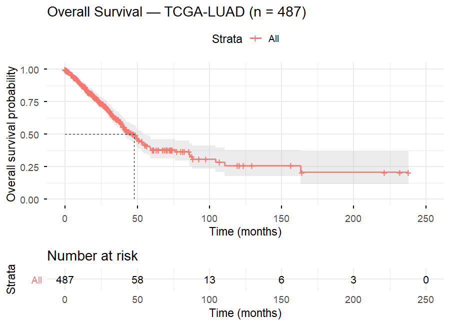
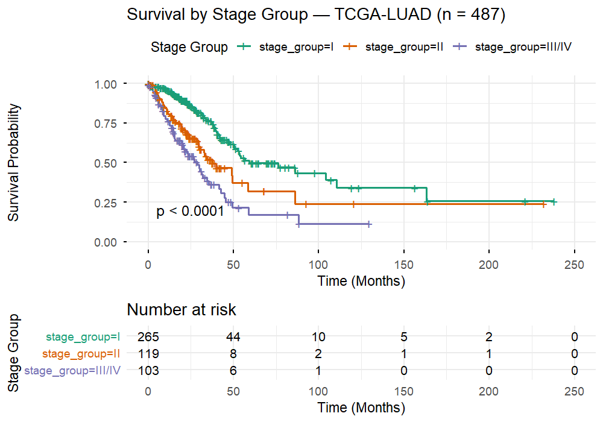
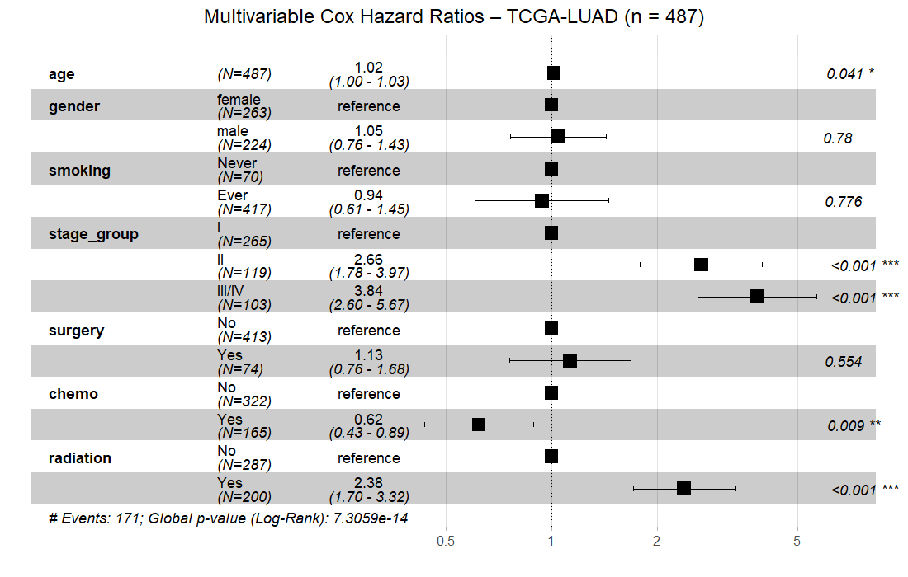

# TCGA-LUAD Survival Analysis Pipeline
A fully reproducible pipeline for cleaning, processing, modeling, and visualizing survival outcomes in **TCGA-LUAD (lung adenocarcinoma)**.  
Includes complete data preparation, modeling (Cox PH), Kaplan–Meier visualizations, and publication-ready figures.

---

## 📌 1. Project Overview
This repository provides a transparent and reproducible workflow for:

- Cleaning TCGA-LUAD clinical data  
- Constructing analysis-ready survival tables  
- Building multivariable Cox proportional hazards models  
- Generating Kaplan–Meier curves (overall + stratified)  
- Producing publication-quality forest plots  
- Saving all outputs into organized folders  

This pipeline is suitable for:
- Cancer bioinformatics research  
- Clinical collaboration  
- AI/ML oncology model development  
- Educational and training use  

---

## 📁 2. Project Structure

```
tcga-luad-survival-pipeline/
├── data_raw/               # Raw data (GDC output)
├── data_clean/             # Final cleaned analysis dataset (RDS)
│   └── luad_data.rds
├── code/                   # All R scripts
│   ├── 01_download.R
│   ├── 02_cleaning.R
│   ├── 03_variable_mapping.R
│   ├── 04_survival_table.R
│   ├── 05_cox_model.R
│   ├── 06_generate_figures.R
│   └── 07_export_results.R
├── results/
│   ├── km_plots/           # Kaplan–Meier images
│   ├── forest_plots/       # Cox forest plot images
│   └── model_summary/      # Model RDS + summary text
├── docs/
│   └── pipeline.md         # Full methods document
└── README.md               # You are here
```

---

## 📊 3. Key Results

### **Kaplan–Meier: Overall Survival**


---

### **Kaplan–Meier by Stage Group (I, II, III/IV)**


---

### **Multivariable Cox Model (Forest Plot)**


---

## 🧠 4. Cox Model Summary

- **N = 487 patients**
- **Events = 171**
- **Predictors included:**
  - age  
  - gender  
  - smoking  
  - stage_group  
  - surgery  
  - chemo  
  - radiation  

Full summary available at:  
➡️ `results/model_summary/cox_summary.txt`

Saved model object:  
➡️ `results/model_summary/cox_model.rds`

---

## 🚀 5. Quick Start

### **Install required R packages**
```r
install. packages(c("survival", "survminer", "tidyverse"))

source("code/06_generate_figures.R")
source("code/07_export_results.R")

---

## 📘 6. Documentation
Full methods are described in:

📄 **docs/pipeline.md**

Includes:
- Data sources  
- Variable definitions  
- Cleaning rules  
- Model formulas  
- Figure generation settings  

---

## 🔒 7. Data Source & Compliance
This project uses publicly accessible TCGA-LUAD data obtained via the NCI Genomic Data Commons (GDC).

- No PHI is included  
- Case identifiers are anonymized UUIDs  
- Follows GDC open-access policies  
- All analysis is for research & education  

---

## 📚 8. Citation
If you use this pipeline, please cite:

The Cancer Genome Atlas (TCGA)
NCI Genomic Data Commons (GDC)

---

## ✉️ 9. Contact
For questions or collaboration opportunities:

Yunlong Qin, PhD
📧 bangong24@outlook.com
 / yqin05@gmail.com

---

## ⭐ Star This Repo
If you find this useful, please consider starring the repository!
